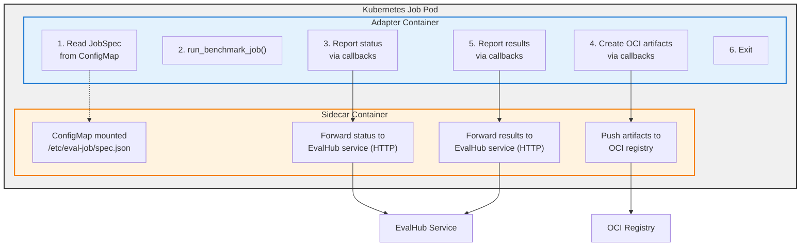

# EvalHub SDK

**Framework Adapter SDK for EvalHub Integration**

The EvalHub SDK provides a standardized way to create framework adapters that can be consumed by EvalHub, enabling a "Bring Your Own Framework" (BYOF) approach for evaluation frameworks.

## Overview

The SDK creates a common API layer that allows EvalHub to communicate with ANY evaluation framework. Users only need to write minimal "glue" code to connect their framework to the standardized interface.

```
EvalHub → (Standard API) → Your Framework Adapter → Your Evaluation Framework
```

## Architecture

The adapter SDK uses a **job runner architecture**:



### Package Organization

The SDK is organized into distinct, focused packages:

**Core (`evalhub.models`)** - Shared data models
- Request/response models for API communication
- Common data structures for evaluations and benchmarks

**Adapter SDK (`evalhub.adapter`)** - Framework adapter components
- `FrameworkAdapter` base class with `run_benchmark_job()` method
- Job specification models (`JobSpec`, `JobResults`)
- Callback interface for status updates and OCI artifacts
- Example implementations

**Client SDK (`evalhub.client`)** - REST API client for EvalHub service
- HTTP client for submitting evaluations to EvalHub
- Resource navigation (providers, benchmarks, collections)
- See [CLIENT_SDK_GUIDE.md](./CLIENT_SDK_GUIDE.md)

### Key Components

1. **JobSpec** - Job configuration loaded from ConfigMap at pod startup
2. **FrameworkAdapter** - Base class that implements `run_benchmark_job()` method
3. **JobCallbacks** - Interface for reporting status and persisting artifacts
4. **JobResults** - Evaluation results returned when job completes
5. **Sidecar** - Container that handles service communication (provided by platform)

## Quick Start

### 1. Installation

```bash
# Install from PyPI (when available)
pip install eval-hub-sdk

# Install from source
git clone https://github.com/eval-hub/eval-hub-sdk.git
cd eval-hub-sdk
pip install -e .[dev]
```

### 2. Create Your Adapter

Create a new Python file for your adapter:

```python
# my_framework_adapter.py
from evalhub.adapter import (
    FrameworkAdapter,
    JobSpec,
    JobCallbacks,
    JobResults,
    JobStatus,
    JobPhase,
    JobStatusUpdate,
    EvaluationResult,
)

class MyFrameworkAdapter(FrameworkAdapter):
    def run_benchmark_job(
        self, config: JobSpec, callbacks: JobCallbacks
    ) -> JobResults:
        """Run a benchmark evaluation job."""

        # Report initialization
        callbacks.report_status(JobStatusUpdate(
            status=JobStatus.RUNNING,
            phase=JobPhase.INITIALIZING,
            progress=0.0,
            message="Loading benchmark and model"
        ))

        # Load your evaluation framework and benchmark
        framework = load_your_framework()
        benchmark = framework.load_benchmark(config.benchmark_id)
        model = framework.load_model(config.model.url)

        # Report evaluation start
        callbacks.report_status(JobStatusUpdate(
            status=JobStatus.RUNNING,
            phase=JobPhase.RUNNING_EVALUATION,
            progress=0.3,
            message=f"Evaluating on {config.num_examples} examples"
        ))

        # Run evaluation
        results = framework.evaluate(
            benchmark=benchmark,
            model=model,
            num_examples=config.num_examples,
            num_few_shot=config.num_few_shot
        )

        # Save and persist artifacts
        output_files = save_results(config.job_id, results)
        artifact = callbacks.create_oci_artifact(OCIArtifactSpec(
            files=output_files,
            job_id=config.job_id,
            benchmark_id=config.benchmark_id,
            model_name=config.model.name
        ))

        # Return results
        return JobResults(
            job_id=config.job_id,
            benchmark_id=config.benchmark_id,
            model_name=config.model.name,
            results=[
                EvaluationResult(
                    metric_name="accuracy",
                    metric_value=results["accuracy"],
                    metric_type="float"
                )
            ],
            num_examples_evaluated=len(results),
            duration_seconds=results["duration"],
            oci_artifact=artifact
        )
```

### 3. OCI Artifact Persistence

The SDK provides built-in OCI artifact persistence. The adapter **always pushes OCI artifacts directly** using the SDK's `OCIArtifactPersister`.

#### Using DefaultCallbacks

Use `DefaultCallbacks` for both production and development:

```python
from evalhub.adapter import DefaultCallbacks
import os

# Production (Kubernetes with sidecar for status updates)
callbacks = DefaultCallbacks(
    sidecar_url="http://localhost:8080",  # Sidecar for status updates
    registry_url="ghcr.io",               # SDK pushes OCI directly
    registry_username=os.getenv("REGISTRY_USER"),
    registry_password=os.getenv("REGISTRY_TOKEN")
)

# Local development (no sidecar)
callbacks = DefaultCallbacks(
    registry_url="localhost:5000",
    insecure=True  # For local registries
)

adapter = MyFrameworkAdapter()
results = adapter.run_benchmark_job(spec, callbacks)
```

**Key Points:**
- **Status updates**: Sent to sidecar if `sidecar_url` is provided, otherwise logged locally
- **OCI artifacts**: Always pushed directly by the SDK using `OCIArtifactPersister`

#### Advanced: Direct Persister Usage

The OCI functionality follows the `Persister` protocol. You can use `OCIArtifactPersister` directly or implement your own:

```python
from evalhub.adapter import OCIArtifactPersister, OCIArtifactSpec, Persister
from pathlib import Path

# Use the default implementation
persister: Persister = OCIArtifactPersister(
    registry_url="ghcr.io",
    username="user",
    password="token"
)

result = persister.persist(
    OCIArtifactSpec(
        files=[Path("results.json"), Path("metrics.csv")],
        job_id="job-123",
        benchmark_id="mmlu",
        model_name="llama-2-7b",
        title="MMLU Evaluation Results",
        annotations={"score": "0.85"}
    )
)

print(f"Pushed to: {result.reference}")
print(f"Digest: {result.digest}")
```

**Custom Persister**: Implement your own `Persister` for custom storage backends:

```python
from evalhub.adapter import Persister, OCIArtifactSpec, OCIArtifactResult

class S3Persister:
    """Custom persister that stores artifacts in S3."""

    def persist(self, spec: OCIArtifactSpec) -> OCIArtifactResult:
        # Upload files to S3
        s3_url = self.upload_to_s3(spec.files)
        return OCIArtifactResult(
            digest=compute_digest(spec.files),
            reference=s3_url,
            size_bytes=compute_size(spec.files)
        )
```

**Requirements**: OCI pushing requires `oras` package:
```bash
pip install oras
```

Without `oras`, the persister will return mock results (useful for testing).

### 4. Containerise Your Adapter

Create a Dockerfile for your adapter:

```dockerfile
FROM registry.access.redhat.com/ubi9/python-312

WORKDIR /app

# Install dependencies
COPY requirements.txt .
RUN pip install --no-cache-dir -r requirements.txt

# Copy adapter code
COPY my_framework_adapter.py .
COPY run_adapter.py .

# Run adapter
CMD ["python", "run_adapter.py"]
```

Create the entrypoint script:

```python
# run_adapter.py
import json
from pathlib import Path
from my_framework_adapter import MyFrameworkAdapter
from evalhub.adapter import JobSpec, DefaultCallbacks

# Load job spec from mounted ConfigMap
config_path = Path("/etc/eval-job/spec.json")
with open(config_path) as f:
    spec_data = json.load(f)

job_spec = JobSpec(**spec_data)

# Create callbacks that communicate with localhost sidecar
callbacks = DefaultCallbacks(sidecar_url="http://localhost:8080")

# Run adapter
adapter = MyFrameworkAdapter()
results = adapter.run_benchmark_job(job_spec, callbacks)

# Report final results to service via sidecar
callbacks.report_results(results)

print(f"Job completed: {results.job_id}")
```

### 4. Deploy to Kubernetes

The eval-hub service will create Kubernetes Jobs for your adapter:

```yaml
apiVersion: batch/v1
kind: Job
metadata:
  name: eval-job-123
spec:
  template:
    spec:
      containers:
      # Your adapter container
      - name: adapter
        image: myregistry/my-adapter:latest
        volumeMounts:
        - name: job-spec
          mountPath: /etc/eval-job
      # Sidecar container (provided by platform)
      - name: sidecar
        image: evalhub/sidecar:latest
        env:
        - name: EVALHUB_SERVICE_URL
          value: "http://evalhub-service:8080"
      volumes:
      - name: job-spec
        configMap:
          name: job-123-spec
```

For a complete working example, see `evalhub/adapter/examples/simple_adapter.py`.

## Package Organization Guide

The EvalHub SDK is organized into distinct packages based on your use case:

### Which Package Should I Use?

| Use Case | Primary Package | Description |
|----------|----------------|-------------|
| **Building an Adapter** | `evalhub.adapter` | Create a framework adapter for your evaluation framework |
| **Interacting with EvalHub** | `evalhub.client` | REST API client for submitting evaluations |
| **Data Models** | `evalhub.models` | Request/response models for API communication |

### Import Patterns

**Framework Adapter Developer:**
```python
# Building your adapter
from evalhub.adapter import (
    FrameworkAdapter,
    JobSpec,
    JobCallbacks,
    JobResults,
    JobStatus,
    JobPhase,
    JobStatusUpdate,
    EvaluationResult,
    OCIArtifactSpec,
)
```

**EvalHub Service User:**
```python
# Interacting with EvalHub REST API
from evalhub.client import EvalHubClient
from evalhub.models.api import ModelConfig, EvaluationRequest
```

## Complete Example

The SDK includes a complete reference implementation showing all adapter patterns:

**Example Adapter**: `src/evalhub/adapter/examples/simple_adapter.py`

This example demonstrates:
- Loading JobSpec from mounted ConfigMap
- Validating configuration
- Loading benchmark data
- Running evaluation with progress reporting
- Persisting results as OCI artifacts
- Returning structured results

### Using the Example

```python
from evalhub.adapter.examples import ExampleAdapter
from evalhub.adapter import JobSpec

# Load job specification
job_spec = JobSpec(
    job_id="eval-123",
    benchmark_id="mmlu",
    model=ModelConfig(
        url="http://vllm-service:8000",
        name="llama-2-7b"
    ),
    num_examples=100
)

# Create adapter and run
adapter = ExampleAdapter()
results = adapter.run_benchmark_job(job_spec, callbacks)
```

## Framework Adapter Interface

Your adapter must implement a single method:

```python
from evalhub.adapter import FrameworkAdapter, JobSpec, JobCallbacks, JobResults

class MyFrameworkAdapter(FrameworkAdapter):
    def run_benchmark_job(
        self, config: JobSpec, callbacks: JobCallbacks
    ) -> JobResults:
        """Run a benchmark evaluation job.

        Args:
            config: Job specification from mounted ConfigMap
            callbacks: Callbacks for status updates and artifact persistence

        Returns:
            JobResults: Evaluation results and metadata

        Raises:
            ValueError: If configuration is invalid
            RuntimeError: If evaluation fails
        """
        # Your implementation here
        pass
```

### Key Data Models

**JobSpec** - Configuration loaded from ConfigMap:
```python
class JobSpec(BaseModel):
    job_id: str                    # Unique job identifier
    benchmark_id: str              # Benchmark to evaluate
    model: ModelConfig             # Model configuration
    num_examples: Optional[int]    # Number of examples to evaluate
    num_few_shot: Optional[int]    # Number of few-shot examples
    random_seed: Optional[int]     # Random seed for reproducibility
    benchmark_config: Dict[str, Any]  # Benchmark-specific parameters
```

**JobCallbacks** - Interface for service communication:
```python
class JobCallbacks(ABC):
    @abstractmethod
    def report_status(self, update: JobStatusUpdate) -> None:
        """Report status update to service"""

    @abstractmethod
    def create_oci_artifact(self, spec: OCIArtifactSpec) -> OCIArtifactResult:
        """Create and push OCI artifact"""
```

**JobResults** - Returned when job completes:
```python
class JobResults(BaseModel):
    job_id: str
    benchmark_id: str
    model_name: str
    results: List[EvaluationResult]           # Evaluation metrics
    overall_score: Optional[float]            # Overall score if applicable
    num_examples_evaluated: int               # Number of examples evaluated
    duration_seconds: float                   # Total evaluation time
    evaluation_metadata: Dict[str, Any]       # Framework-specific metadata
    oci_artifact: Optional[OCIArtifactResult] # OCI artifact info if persisted
```

## Deployment

### Container Structure

Your adapter runs as a container in a Kubernetes Job alongside a sidecar:

```dockerfile
FROM registry.access.redhat.com/ubi9/python-312

WORKDIR /app

# Install your framework and dependencies
RUN pip install lm-evaluation-harness==0.4.0 eval-hub-sdk

# Copy adapter implementation
COPY my_adapter.py .
COPY entrypoint.py .

CMD ["python", "entrypoint.py"]
```

### Entrypoint Script

```python
# entrypoint.py
import json
from pathlib import Path
from my_adapter import MyFrameworkAdapter
from evalhub.adapter import JobSpec, DefaultCallbacks

# Load job spec from mounted ConfigMap
config_path = Path("/etc/eval-job/spec.json")
with open(config_path) as f:
    job_spec = JobSpec(**json.load(f))

# Create callbacks (communicate with sidecar on localhost:8080)
callbacks = DefaultCallbacks(sidecar_url="http://localhost:8080")

# Run adapter
adapter = MyFrameworkAdapter()
results = adapter.run_benchmark_job(job_spec, callbacks)

# Report final results to service via sidecar
callbacks.report_results(results)

print(f"Job {results.job_id} completed with score: {results.overall_score}")
```

### Kubernetes Job

EvalHub creates Jobs automatically:

```yaml
apiVersion: batch/v1
kind: Job
metadata:
  name: eval-job-123
spec:
  template:
    spec:
      containers:
      - name: adapter
        image: myregistry/my-framework-adapter:latest
        volumeMounts:
        - name: job-spec
          mountPath: /etc/eval-job
      - name: sidecar
        image: evalhub/sidecar:latest
        env:
        - name: EVALHUB_SERVICE_URL
          value: "http://evalhub-service:8080"
      volumes:
      - name: job-spec
        configMap:
          name: job-123-spec
      restartPolicy: Never
```

## Development

### Setting Up Development Environment
### Development Setup

```bash
# Clone the repository
git clone https://github.com/eval-hub/eval-hub-sdk.git
cd eval-hub-sdk

# Install in development mode with all dependencies
pip install -e .[dev]

# Install pre-commit hooks
pre-commit install

# Run tests
pytest

# Run tests with coverage
pytest --cov=src/evalhub --cov-report=html

# Run type checking
mypy src/evalhub

# Run linting
ruff check src/ tests/
ruff format src/ tests/
```

### Testing Your Adapter

```python
import pytest
from evalhub.adapter.client import AdapterClient

@pytest.mark.asyncio
async def test_adapter_health():
    async with AdapterClient("http://localhost:8080") as client:
        health = await client.health_check()
        assert health.status == "healthy"

@pytest.mark.asyncio
async def test_list_benchmarks():
    async with AdapterClient("http://localhost:8080") as client:
        benchmarks = await client.list_benchmarks()
        assert len(benchmarks) > 0
        assert all(b.benchmark_id for b in benchmarks)
```

### Development Server

```bash
# Run with auto-reload for development
evalhub-adapter run my_adapter:MyAdapter --reload --log-level DEBUG
```

### Quality Assurance


Run all quality checks:
```bash
# Format code
ruff format .

# Lint and fix issues
ruff check --fix .

# Type check
mypy src/evalhub

# Run full test suite
pytest -v --cov=src/evalhub
```

## Contributing

1. Fork the repository
2. Create a feature branch
3. Make your changes
4. Add tests for your changes
5. Run the test suite
6. Submit a pull request

## License

This project is licensed under the Apache License 2.0 - see the [LICENSE](LICENSE) file for details.
