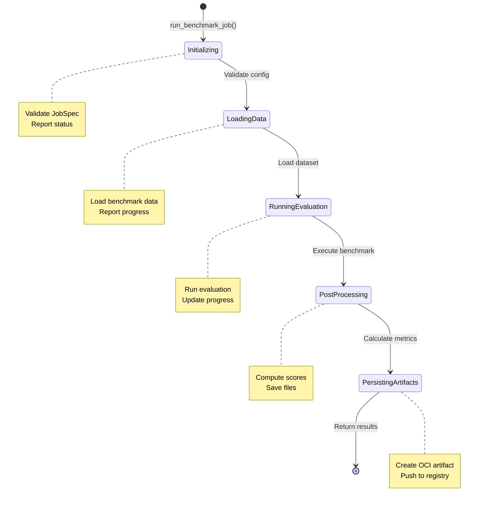
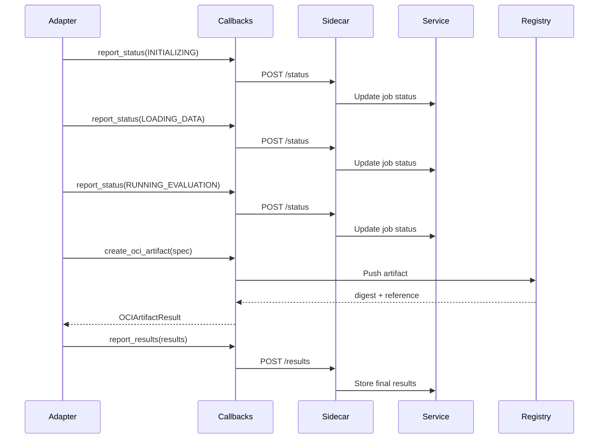
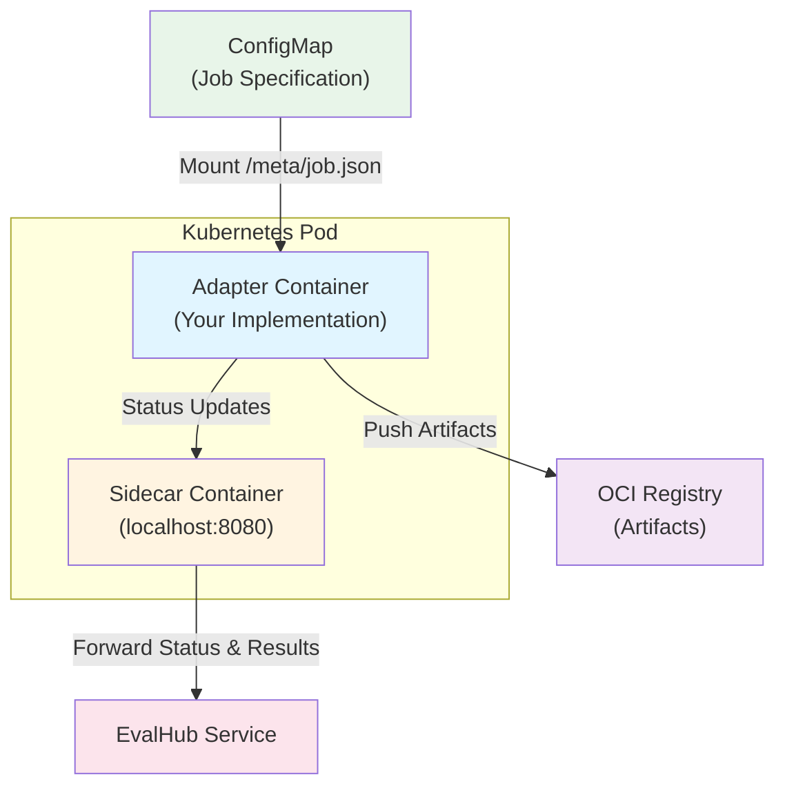

# Simple Adapter Example

This example demonstrates how to implement a framework adapter using the EvalHub SDK.

## Overview

The `simple_adapter.py` shows a complete implementation of a benchmark evaluation adapter that:

1. Reads job configuration from a mounted ConfigMap
2. Executes benchmark evaluation
3. Reports progress via callbacks
4. Persists results as OCI artifacts
5. Returns structured results

## Key Components

### ExampleAdapter Class

The adapter implements the `FrameworkAdapter` interface with a single method:

```python
def run_benchmark_job(self, config: JobSpec, callbacks: JobCallbacks) -> JobResults
```

This method handles the complete job lifecycle:



**Phases:**
- **Initialization** - Validate configuration
- **Data Loading** - Load benchmark dataset
- **Evaluation** - Run the benchmark against the model
- **Post-processing** - Calculate scores and metrics
- **Persistence** - Save results as OCI artifacts

### Callback Pattern

The adapter uses callbacks to communicate with the EvalHub service:

```python
# Report status updates
callbacks.report_status(JobStatusUpdate(
    status=JobStatus.RUNNING,
    phase=JobPhase.RUNNING_EVALUATION,
    progress=0.5
))

# Create OCI artifact
artifact = callbacks.create_oci_artifact(OCIArtifactSpec(
    files=[results_file],
    job_id=job_id,
    benchmark_id=benchmark_id,
    model_name=model_name
))

# Report final results
callbacks.report_results(results)
```

#### Callback Flow



## Running the Example

### In Production (Kubernetes Pod)

The adapter runs as a container in a Kubernetes pod with:

1. **ConfigMap** containing the job specification at `/meta/job.json`
2. **Sidecar container** listening on `http://localhost:8080` for callbacks
3. **Environment variables** for registry credentials

Example job spec in ConfigMap:

```json
{
  "job_id": "eval-001",
  "benchmark_id": "mmlu",
  "model": {
    "url": "http://model-server:8000/v1",
    "name": "llama-2-7b"
  },
  "num_examples": 100,
  "num_few_shot": 5,
  "random_seed": 42
}
```

The adapter automatically:
- Reads the spec from the ConfigMap
- Sends status updates to the sidecar
- Pushes OCI artifacts to the registry
- Reports final results to the service

### Local Development

For local testing without Kubernetes:

```python
from pathlib import Path
import json
from evalhub.adapter.examples import ExampleAdapter
from evalhub.adapter import JobSpec, JobCallbacks, JobStatusUpdate, JobResults, OCIArtifactSpec, OCIArtifactResult

# Create mock callbacks for local testing
class LocalCallbacks(JobCallbacks):
    def report_status(self, update: JobStatusUpdate) -> None:
        print(f"Status: {update.status} - {update.message}")

    def create_oci_artifact(self, spec: OCIArtifactSpec) -> OCIArtifactResult:
        print(f"Would create artifact with {len(spec.files)} files")
        return OCIArtifactResult(
            digest="sha256:local",
            reference="localhost/test",
            size_bytes=1024
        )

    def report_results(self, results: JobResults) -> None:
        print(f"Results: {results.overall_score}")

# Create job spec
spec = JobSpec(
    job_id="local-test",
    benchmark_id="mmlu",
    model={"url": "http://localhost:8000", "name": "test-model"},
    num_examples=10
)

# Run adapter
adapter = ExampleAdapter()
callbacks = LocalCallbacks()
results = adapter.run_benchmark_job(spec, callbacks)

print(f"Completed: {results.job_id}")
print(f"Score: {results.overall_score}")
```

## Containerization

Example Dockerfile for deploying the adapter:

```dockerfile
FROM registry.access.redhat.com/ubi9/python-312

# Install adapter SDK
COPY requirements.txt .
RUN pip install --no-cache-dir -r requirements.txt

# Copy adapter implementation
COPY simple_adapter.py /app/adapter.py

WORKDIR /app

# Run adapter (reads config from /meta/job.json, configurable via EVALHUB_JOB_SPEC_PATH)
CMD ["python", "adapter.py"]
```

Example `requirements.txt`:

```
eval-hub-sdk[adapter]>=0.1.0
# Add your framework dependencies here, e.g.:
# lm-eval>=0.4.0
# ragas>=0.1.0
```

## Extending the Example

To implement your own adapter for a different framework:

1. **Replace the evaluation logic** in `_evaluate()` to call your framework
2. **Update dataset loading** in `_load_dataset()` to load your benchmark data
3. **Customize metrics** in `_compute_overall_score()` and return appropriate results
4. **Add framework-specific configuration** to `benchmark_config` in JobSpec

The adapter pattern handles all the infrastructure (status reporting, OCI artifacts, job lifecycle) so you only need to implement the framework-specific evaluation logic.

## Architecture



## See Also

- [Main README](../../README.md) - Full SDK documentation
- [Adapter SDK Guide](../../docs/adapter-sdk.md) - Detailed adapter development guide
- [API Documentation](../../docs/api.md) - Complete API reference
